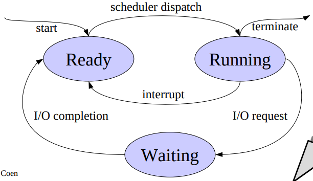

#Introduzione alla concorrenza
Modello concorrente basato su la definizione astratta di processo: suggerisce l'esecuzione contemporanea di attività svolte dal processore e dai dispositivi vollegati ad un elaboratore.

Il processo è l'attività dell'esecuzione di un programma, è dinamico a differenza del programma. Diversi processi possono eseguire lo stesso programma
Esso viene descritto da:
- la sua immagine in memoria(memoria assegnata o strutture dati del s.o. asssegnate)
- la sua imamgine nel processore(contenuto del registri)
- lo stato di avanzamento(esecuzione o attesa)

Gestione prcoessi multipli:
- multiprogramming:
    - più processi su un processore
    - parallelismo apparante
    - si parla di interleaving, si simula un multiprocessore alternando nel tempo i processi
- multiprocessing:
    - più processi su più processori
    - parallelismo reale
    - i processi sono alteranti nello spazio, si parla di overlapping
- distributed processing:
    - più processi su più computer
    - parallelismo reale

Due programmi sono concorrenti se eseguiti in parallelo, i problemi principali sono <u>la comunicazione e la sincronizzazione</u>

Race condition: un sistema di processi multipli produce un rislutato finale dipendente dalla temporizzazione dei processi
Necessario non avere race condition per scrivere un programma concorrente

